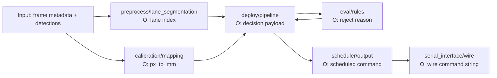

# agents.md

## Purpose
Working guide for contributors and automation agents in `ColourSorter`.

## Current system scope
- Bench-first pipeline for colour sorting validation.
- Core modules already present:
  - `src/coloursorter/preprocess` (lane segmentation)
  - `src/coloursorter/model` (types/contracts)
  - `src/coloursorter/train` (training placeholder package)
  - `src/coloursorter/eval` (rules)
  - `src/coloursorter/deploy` (pipeline orchestration)
  - `src/coloursorter/scheduler` and `src/coloursorter/serial_interface` (actuation + wire format)
  - `src/coloursorter/bench` and `gui/bench_app` (bench simulation + UI)

## Deterministic naming conventions
- Use stable, descriptive snake_case for Python identifiers.
- Keep config filenames canonical:
  - `configs/default_config.yaml`
  - `configs/bench_runtime.yaml`
  - `configs/lane_geometry.yaml`
  - `configs/calibration.json`
- Keep schema filenames aligned with protocol naming:
  - `contracts/frame_schema.json`
  - `contracts/sched_schema.json`
  - `contracts/mcu_response_schema.json`

## I/O and dependency map (high level)

## Documentation upkeep
- Keep top-level docs cross-linked through `README.md` and `docs/openspec/README.md`.
- When runtime commands or config keys change, update docs in the same commit.
- Prefer command examples that are executable as-written from repository root.

## Contribution checks (static + runtime)
- Keep type hints on public functions/classes.
- Add essential runtime checks at boundaries (config load, protocol parse, payload shape).
- Prefer small modules with explicit I/O contracts over broad utility layers.
- Keep docs in sync with code paths under `src/coloursorter/*`.

## Bench execution entry points
- CLI bench: `coloursorter-bench-cli --avg-rtt-ms 10 --peak-rtt-ms 20`
- GUI bench: `coloursorter-bench-gui --config configs/bench_runtime.yaml`
