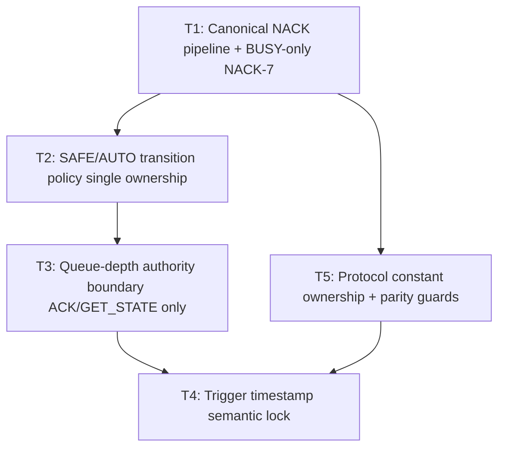

# Engineering Audit Sprint Board (Static Refactor Plan)

## Scope lock
- Static audit + deterministic implementation planning only (no runtime execution in this planning pass).
- Safety-critical invariants prioritized: canonical NACK semantics, SAFE transition admissibility, queue-depth authority, and deterministic trigger timestamp rules.
- OpenSpec v3 artifacts remain single source of truth; runtime/tests/docs must mirror artifacts, not redefine policy.

## Objective function
1. Preserve safety-critical protocol/state invariants (SAFE transitions, canonical NACK semantics, queue/scheduler coherence).
2. Maintain deterministic timing/telemetry behavior for bench + transport paths.
3. Keep OpenSpec v3 artifact parity as single-source-of-truth behavior.
4. Minimize architectural drift by reducing duplicated authority across protocol/GUI/transport layers.
5. Sustain test-gated change safety with minimal regression risk.

## Canonical authority map
- Protocol constants + NACK code-space authority: `docs/openspec/v3/protocol/commands.json`.
- Mode transition authority: `docs/openspec/v3/state_machine.md` mirrored in `src/coloursorter/protocol/policy.py`.
- Queue-depth truth authority: ACK metadata + `GET_STATE` snapshots from host protocol responses.
- Trigger timestamp semantics authority: `docs/openspec/v3/telemetry_schema.md` and deterministic telemetry tests.

## Drift hotspots (static audit)
1. NACK semantics are mostly aligned, but degradation behavior for non-canonical payloads must stay explicitly documented as defensive SAFE fallback.
2. SAFE policy logic risks duplication across spec, protocol policy helpers, host guards, and GUI recovery flow.
3. Queue-depth display/cache logic in GUI can leak into policy interpretation if not clearly marked derived-only.
4. Trigger timestamp wording can still be interpreted ambiguously unless projection anchors are stated identically in docs/tests/runtime comments.
5. Protocol constants are mirrored in multiple code modules and docs; parity checks exist but should fully guard the allowed envelope.

## Execution graph (single bundle, phased)

## Ordered implementation tasks

| ID | Required order | Impact | Risk | Modules | Deterministic completion target |
|---|---:|---|---|---|---|
| T1_canonical_nack_pipeline | 1 | Safety | Medium | `src/coloursorter/protocol/nack_codes.py`, `src/coloursorter/protocol/host.py`, `src/coloursorter/bench/serial_transport.py`, protocol docs/tests | NACK `1..8` canonical; NACK-7 used only as `BUSY`; WATCHDOG handled as timeout/fault telemetry, not NACK alias. |
| T5_constants_ownership_guard | 1 (condensed with T1) | Architecture | Low | `docs/openspec/v3/protocol/commands.json`, `src/coloursorter/protocol/constants.py`, `src/coloursorter/protocol/authority.py`, shared-constants tests | One declared authority + one code mirror with parity assertions for commands/ranges/version/capabilities/NACK bounds. |
| T2_safe_policy_single_auth | 2 | Determinism | Medium | `docs/openspec/v3/state_machine.md`, `src/coloursorter/protocol/policy.py`, `src/coloursorter/protocol/host.py`, `gui/bench_app/controller.py` | SAFE->AUTO always rejected as `NACK|5|INVALID_MODE_TRANSITION`; recovery path only SAFE->MANUAL->AUTO. |
| T3_queue_depth_authority_boundary | 2 (after T2) | Safety | Low | `src/coloursorter/bench/serial_transport.py`, `gui/bench_app/controller.py`, queue-depth tests/docs | Queue depth mutates only from ACK/GET_STATE truth; GUI cache stays display-only and non-authoritative. |
| T4_trigger_timestamp_semantic_lock | 3 | Determinism | Low | `docs/openspec/v3/telemetry_schema.md`, `src/coloursorter/bench/runner.py`, `src/coloursorter/bench/virtual_encoder.py`, telemetry tests | `trigger_timestamp = trigger_generation + schedule_time + travel_time`; zero-speed/dropout deterministic behavior explicit and tested. |

## Bundle acceptance gates
- **Gate A (T1+T5):** Canonical NACK map + constants ownership parity complete before transition-policy edits.
- **Gate B (T2+T3):** SAFE transition and queue authority unified before timestamp normalization.
- **Gate C (T4):** Trigger timestamp semantics textually identical across docs/runtime/tests.

## Verification command set (to run during implementation phase)
- `rg -n "NACK-7|WATCHDOG|NACK_BUSY|CANONICAL_NACK_7" src/coloursorter tests docs/openspec/v3`
- `rg -n "MODE_TRANSITIONS|SAFE -> AUTO|INVALID_MODE_TRANSITION|recover_safe_to_manual|recover_to_auto" docs/openspec/v3/state_machine.md src/coloursorter/protocol gui/bench_app tests`
- `rg -n "queue_depth|GET_STATE|queue_cleared|_latest_transport_queue_depth|_transport_queue_depth" src/coloursorter/bench/serial_transport.py gui/bench_app/controller.py tests`
- `rg -n "trigger_generation|trigger_timestamp|zero-speed|dropout|actuation_cycle" docs/openspec/v3/telemetry_schema.md src/coloursorter/bench/runner.py src/coloursorter/bench/virtual_encoder.py tests/test_determinism_and_telemetry.py`
- `rg -n "SUPPORTED_PROTOCOL_VERSION|SUPPORTED_CAPABILITIES|LANE_MIN|LANE_MAX|TRIGGER_MM_MIN|TRIGGER_MM_MAX|NACK_" src/coloursorter docs/openspec/v3/protocol/commands.json tests/test_protocol_shared_constants.py`

## Risk controls
- No public API or schema redesign; parity cleanup only.
- Defensive SAFE degradation for malformed/non-canonical transport NACK payloads remains intentional and documented.
- Rollback strategy remains `git revert`-friendly by preserving phased commit boundaries.
