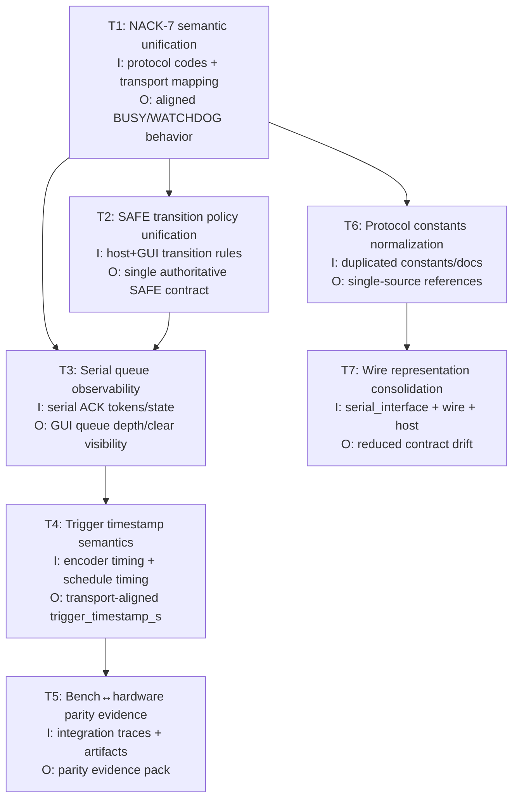

# Engineering Audit Sprint Board (Execution-Ready)

## Scope + sequencing
- Source: `docs/engineering_audit_next_sprint.md` action priorities.
- Goal: convert audit findings into implementation-ready tickets with dependencies, owner role, and hard acceptance checks.

## Dependency diagram (I/O + module dependencies)

## Sprint board

| ID | Priority | Owner role | Module(s) | Task (deterministic) | Depends on | Effort | Acceptance checks |
|---|---|---|---|---|---|---|---|
| T1_nack_code_7_alignment | P0 | Protocol engineer | `src/coloursorter/bench/serial_transport.py`, `src/coloursorter/protocol/host.py`, protocol docs/tests | Make NACK code `7` semantics explicit and identical across host + serial transport (BUSY vs WATCHDOG interpretation must be unambiguous). | None | S | `tests/test_protocol_compliance_v3.py` asserts code-7 behavior; serial transport mapping test added/updated; docs mention exact semantic. |
| T2_safe_policy_unification | P0 | Runtime/GUI engineer | `src/coloursorter/protocol/host.py`, `gui/bench_app/controller.py`, `docs/openspec/v3/state_machine.md` | Define one SAFE transition contract and enforce it in host + GUI recovery path. | T1 | M | SAFE transition matrix in spec + tests cover allowed/forbidden transitions for host and GUI recovery entry points. |
| T3_serial_queue_observability | P0 | GUI engineer | `gui/bench_app/controller.py`, serial response plumbing | Surface real queue depth + queue clear state in serial mode (remove static fallback behavior). | T1, T2 | M | UI state model receives queue depth/clear tokens in serial path; regression test proves non-zero/changed depth handling. |
| T4_trigger_timestamp_transport_aligned | P1 | Bench runtime engineer | `src/coloursorter/bench/runner.py`, `src/coloursorter/bench/virtual_encoder.py`, telemetry docs/tests | Recompute `trigger_timestamp_s` as modeled trigger execution time at transport/scheduler boundary (not pulse-presence proxy). | T3 | M | Deterministic telemetry tests verify timestamp progression under pulse/no-pulse conditions and transport latency scenarios. |
| T5_bench_hardware_parity_evidence | P1 | Integration engineer | transport/integration boundary + `docs/artifacts/hardware_readiness/*` | Produce parity evidence pack proving protocol/timing consistency between bench and hardware traces. | T1, T4 | L | Artifact bundle includes matched command/ACK/NACK/timing envelopes with summary deltas and pass/fail gates. |
| T6_protocol_constants_single_source | P1 | Architecture engineer | scheduler/protocol/serial + docs artifacts | Eliminate duplicated protocol constants and pin one canonical source with generated/validated mirrors. | T1 | M | Static check/test fails on divergence between canonical constants and artifact mirrors. |
| T7_wire_representation_consolidation | P2 | Architecture engineer | `serial_interface.py`, `wire.py`, `protocol/host.py` | Minimize overlapping wire representations to reduce contract drift and parsing ambiguity. | T6 | M | Shared parser/encoder contract path documented; contract tests cover frame encode/decode across layers. |
| T8_detection_provider_maturity | P2 | CV engineer | `src/coloursorter/deploy/detection.py` | Upgrade from baseline contour-only detector to production-capable provider abstraction with explicit runtime capability checks. | None | L | Benchmark comparison report + deterministic fallback behavior documented. |
| T9_runtime_timing_budget_enforcement | P2 | Runtime engineer | `src/coloursorter/bench/runner.py`, `src/coloursorter/bench/evaluation.py` | Add runtime budget guardrails (not post-hoc only) for overrun response policy. | T4 | M | Scenario tests demonstrate live budget threshold handling and emitted policy actions. |
| T10_plan_path_normalization | P0 | Tech lead | sprint plan/task tracker docs | Normalize stale task paths/commands to current repo layout before execution tracking starts. | None | S | All task references resolve to valid files and runnable checkpoints (no truncated commands). |

## Explicit kickoff prompts (copy/paste)

| Task ID | Prompt |
|---|---|
| T1_nack_code_7_alignment | `Implement T1_nack_code_7_alignment: align NACK code 7 semantics across src/coloursorter/bench/serial_transport.py and src/coloursorter/protocol/host.py; update protocol docs/tests so BUSY vs WATCHDOG interpretation is unambiguous; run targeted protocol compliance tests and summarize deltas.` |
| T2_safe_policy_unification | `Implement T2_safe_policy_unification: define one SAFE transition contract across src/coloursorter/protocol/host.py, gui/bench_app/controller.py, and docs/openspec/v3/state_machine.md; add/update tests for allowed and forbidden transitions; provide a transition matrix in the summary.` |
| T3_serial_queue_observability | `Implement T3_serial_queue_observability: wire serial ACK/telemetry queue depth and queue-cleared signals into gui/bench_app/controller.py state updates; remove static fallback behavior; add regression coverage for serial-mode queue state display.` |
| T4_trigger_timestamp_transport_aligned | `Implement T4_trigger_timestamp_transport_aligned: update src/coloursorter/bench/runner.py and src/coloursorter/bench/virtual_encoder.py so trigger_timestamp_s represents transport/scheduler-aligned trigger execution time; update telemetry docs/tests; verify deterministic behavior under pulse/no-pulse cases.` |
| T5_bench_hardware_parity_evidence | `Execute T5_bench_hardware_parity_evidence: generate an artifact bundle under docs/artifacts/hardware_readiness/* comparing bench vs hardware protocol/timing traces; include command/ACK/NACK/timing envelope deltas and pass/fail gate summary.` |
| T6_protocol_constants_single_source | `Implement T6_protocol_constants_single_source: establish one canonical protocol-constants source for scheduler/protocol/serial layers and mirrored docs artifacts; add a check/test that fails on divergence.` |
| T7_wire_representation_consolidation | `Implement T7_wire_representation_consolidation: reduce overlapping wire representations across serial_interface.py, wire.py, and protocol/host.py; document the shared encode/decode contract and add contract tests.` |
| T8_detection_provider_maturity | `Implement T8_detection_provider_maturity: evolve src/coloursorter/deploy/detection.py from contour-only baseline to a production-capable provider abstraction with explicit runtime capability checks and deterministic fallback behavior; include benchmark comparison notes.` |
| T9_runtime_timing_budget_enforcement | `Implement T9_runtime_timing_budget_enforcement: add runtime timing-budget guardrails in src/coloursorter/bench/runner.py and src/coloursorter/bench/evaluation.py so overrun responses occur during runtime (not post-hoc only); add scenario coverage.` |
| T10_plan_path_normalization | `Execute T10_plan_path_normalization: update sprint task tracker references to valid repo paths and runnable checkpoints only (no truncated commands); provide before/after path mapping table.` |

## Milestone cut

| Milestone | Included tickets | Exit criteria |
|---|---|---|
| M1_critical_contract_alignment | T1, T2, T3, T10 | Protocol + SAFE + serial observability aligned; task tracker references valid repo paths. |
| M2_timing_and_evidence | T4, T5 | Trigger timing semantics corrected and parity evidence available. |
| M3_architecture_debt_reduction | T6, T7, T8, T9 | Drift risks reduced; detection and runtime budget controls improved. |

## Recommended immediate start (first 5 working days)
1. Day 1: T10 path normalization + T1 design review kickoff.
2. Day 2: T1 implementation/tests/docs.
3. Day 3: T2 state-contract merge and transition tests.
4. Day 4: T3 serial queue token plumbing + GUI tests.
5. Day 5: M1 gate review and release note draft.
