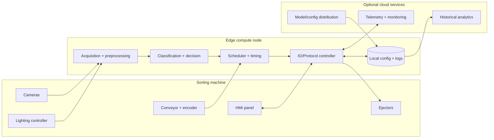

# OpenSpec v3 System Architecture and Operating Modes

This document defines the high-level system topology and operating mode semantics used by the OpenSpec v3 stack. Mode semantics here are aligned with the controller and firmware state machines.

Related state machine references:
- Controller mode/scheduler semantics: [`state_machine.md`](./state_machine.md)
- Firmware runtime/fault semantics: [`firmware_state_machine.md`](./firmware_state_machine.md)

## Document authority and location

This file is the authoritative OpenSpec architecture reference for this repository. Process references that point to `architecture/*` should be interpreted as referring to `docs/openspec/` (and specifically this document for system architecture semantics).

## High-level block diagram

## Operating modes

### Setup
Used for machine bring-up, recipe/config selection, I/O verification, and initial checks before calibration or production.

Expected behavior:
- Conveyor and ejector motion is operator-gated and generally low-risk/manual.
- Configuration changes are allowed (lane geometry, camera assignment, serial/MCU endpoints).
- Throughput metrics are informational only; reject timing is not considered production-valid.

### Calibrate
Used to establish or refresh camera calibration, lane geometry, illumination baselines, and encoder alignment.

Expected behavior:
- Capture and calibration workflows are enabled.
- Automatic reject decisions are disabled or routed to no-fire/test paths until calibration is accepted.
- A successful calibration handoff is a prerequisite for sustained production operation.

### Production
Normal automated sorting mode with closed-loop timing from encoder pulses and active ejector control.

Expected behavior:
- Scheduler is active and controls reject timing.
- Classification/decision outputs can trigger ejectors.
- Operator interventions are constrained to safe controls and approved mode changes.

### Maintenance
Used for servicing, diagnostics, and component testing.

Expected behavior:
- Manual jog/test actions are allowed for specific subsystems (lighting, ejectors, sensors).
- Automatic production scheduling is suspended.
- Additional diagnostic telemetry/log verbosity may be enabled.

### Offline
Operation with cloud links unavailable and/or external dependencies reduced, while local control remains available when safe.

Expected behavior:
- Local HMI + edge compute continue with last-known-good configuration.
- Cloud telemetry, model pulls, and remote fleet operations are deferred.
- If local safety/heartbeat constraints fail, controller follows degraded/safe paths from firmware/controller state machines.

## Mode transition table

The table below captures operational intent-level transitions. Command-level controller transitions and fault-latch transitions remain normative in the state machine documents.

| From | To | Entry conditions | Exit conditions | Allowed operators | Degraded/offline behavior |
| --- | --- | --- | --- | --- | --- |
| Setup | Calibrate | Machine communication healthy; required sensors/cameras discovered; operator selects calibration workflow. | Calibration started or mode changed by authorized operator. | Technician, Engineer | If cloud unavailable, continue with local calibration assets; if comms fault occurs, transition to Maintenance or safety path per firmware/controller state machines. |
| Calibrate | Setup | Calibration session aborted or operator requests config edits. | Operator commits changes or switches mode. | Technician, Engineer | Operates locally; pending cloud sync is deferred. Faults follow degraded/safe state machine behavior. |
| Calibrate | Production | Calibration validated/accepted; timing checks pass; safety interlocks satisfied. | Production started, or operator exits to Setup/Maintenance. | Engineer, Supervisor | Production may proceed in local-only (offline) mode using last-known-good model/config; if heartbeat/watchdog faults occur, follow `DEGRADED`/`SAFE_HALT` and SAFE controller behavior. |
| Production | Maintenance | Planned stop, fault diagnosis request, or automatic fault latch requiring intervention. | Maintenance tasks complete and authorized mode change occurs. | Technician, Engineer, Supervisor | On connectivity loss, continue local production if safe; on control-path degradation, reduce to safe/manual behavior per state machines. |
| Maintenance | Setup | Service complete; machine reassembled and basic checks pass. | Operator resumes setup/calibration workflow. | Technician, Engineer | Fully local operation expected; cloud services optional. |
| Production | Offline | Cloud connectivity loss detected while local edge + machine control remain healthy. | Cloud connectivity restored and optional re-sync completes; or operator changes mode. | System auto-detect + Supervisor override | Stay in local production envelope; queue telemetry/model updates for later. If local safety constraints degrade, transition to Maintenance/SAFE paths. |
| Offline | Production | Cloud restored (optional) and local production prerequisites remain valid. | Normal production exit rules apply. | Supervisor, System policy | Flush deferred telemetry/config reconciliation without blocking safety-critical control. |
| Any | Maintenance | Fault, service request, or manual intervention requirement. | Service complete and authorized transition selected. | Technician, Engineer | If severe fault (watchdog/brownout) occurs, firmware may latch `SAFE_HALT`; recovery path must honor controller/firmware state machine constraints. |

## Consistency with state-machine specifications

To keep semantics consistent across OpenSpec artifacts:
- Controller mode transitions, queue-clearing behavior, and SAFE recovery constraints are defined in [`state_machine.md`](./state_machine.md).
- Firmware runtime states (`READY`, `DEGRADED`, `SAFE_HALT`) and hardware-fault recovery expectations are defined in [`firmware_state_machine.md`](./firmware_state_machine.md).
- When this document and state machine docs diverge, the state machine docs are normative for command/fault behavior.
