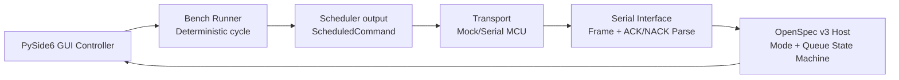

# ColourSorter Three-Pass Completion Report

## PASS 1 — System Audit & Risk Map

### End-to-end architecture summary (current state)

| Stage | Module(s) | Current role | Main contract boundary |
|---|---|---|---|
| GUI | `gui/bench_app/controller.py`, `gui/bench_app/app.py` | Operator controls replay/live/home, receives runtime telemetry and protocol-derived queue/mode state. | Qt signals/slots + `BenchLogEntry` payloads. |
| Scheduler | `src/coloursorter/scheduler/output.py` | Converts validated lane/position into deterministic `ScheduledCommand`. | Lane and trigger range validation. |
| Protocol | `src/coloursorter/protocol/host.py`, `policy.py`, `constants.py`, `nack_codes.py` | OpenSpec v3 command dispatch (`SET_MODE`, `SCHED`, `GET_STATE`, `RESET_QUEUE`), mode transition policy, ACK/NACK encoding. | `<CMD|...>` frame + canonical ACK/NACK semantics. |
| Serial interface | `src/coloursorter/serial_interface/serial_interface.py`, `wire.py` | Frame parsing/serialization and strict token validation for ACK/NACK payloads. | ASCII framed packets + metadata parsing checks. |
| Bench runtime | `src/coloursorter/bench/runner.py`, `mock_transport.py`, `serial_transport.py` | Deterministic cycle execution and transport abstraction for mock/hardware parity checks. | `TransportResponse` and fault-state mapping. |
| Hardware transport | `src/coloursorter/bench/serial_transport.py` | Retry/backoff, timeout handling, ACK/NACK to fault mapping. | Structured `SerialTransportError` + `TransportResponse`. |

### Gap analysis

| Area | Gap | Risk |
|---|---|---|
| Spec safety | `SCHED` accepted while host mode is `SAFE`, enabling queue growth in a safety mode. | **High** |
| GUI resilience | Transport mode token is cast directly to `OperatorMode`; unknown token can raise and crash update path. | **High** |
| ACK/NACK strictness | Existing parser already enforces canonical formatting for most paths; no code change needed in this pass. | Low |
| Queue semantics | Queue clear on mode change exists; needed explicit SAFE scheduling guard for full alignment. | Medium |
| Bench/hardware parity | Core semantics already close; safety handling needs stronger invalid-token containment in GUI path. | Medium |

### Ordered completion roadmap (dependency-aware)

1. Enforce OpenSpec-safe scheduling guard in protocol host (`SAFE` must reject `SCHED`).
2. Add GUI containment for invalid transport mode token (fail-safe transition + log evidence).
3. Add tests for both safety behaviors.
4. Re-run targeted tests then full suite.
5. PASS 3 hardening artifacts: bench/hardware checklist + determinism confirmation.

### PASS 1 stop point (approval checkpoint)

Audit complete; proceed to deterministic-core fixes only (no architecture redesign).

---

## PASS 2 — Deterministic Core Completion (implemented)

### Minimal change set

1. `OpenSpecV3Host._sched` now rejects scheduling while in `SAFE` using canonical `NACK|5|INVALID_MODE_TRANSITION`.
2. GUI controller now validates transport mode token before enum conversion. Invalid tokens now:
   - force `fault_state=SAFE`
   - set scheduler state `IDLE`
   - transition controller to SAFE overlay
   - emit a structured log marker `protocol_mode_parse_error`
3. Added regression tests for both behaviors.

### Bench validation steps

1. Run protocol compliance tests to verify OpenSpec rules.
2. Run GUI controller tests for signal-slot safety behavior.
3. Run full pytest suite.

### Spec alignment confirmation

- Modes and deterministic transitions remain centralized in protocol policy.
- Queue clearing on mode change remains intact.
- SAFE fallback now blocks any new scheduling.
- Invalid transport metadata now defaults to safe containment rather than undefined GUI behavior.

---

## PASS 3 — Hardening & Validation

### Validation guards added

- Runtime mode-token validation in GUI transport response path.
- Protocol guard preventing unsafe `SCHED` in SAFE mode.

### Error containment

- Invalid transport mode token no longer risks unhandled enum conversion failures.
- GUI transitions deterministically into SAFE and records a diagnosis log entry.

### Logging improvement

- Added explicit `protocol_mode_parse_error` decision marker with rejection reason `invalid_mode_token:<token>`.

### Bench test checklist

- [ ] Protocol: `SET_MODE`, `SCHED`, `GET_STATE`, `RESET_QUEUE` all tested.
- [ ] SAFE: verify `SCHED` in SAFE returns `NACK|5`.
- [ ] Queue: verify mode changes clear queue and return `queue_cleared=true` when applicable.
- [ ] GUI: inject invalid mode token and verify SAFE transition + log evidence.
- [ ] Determinism: replay run produces stable queue depth/mode telemetry progression.

### Hardware test checklist

- [ ] Capture serial trace proving ACK metadata fields (`mode|queue_depth|scheduler_state|queue_cleared`).
- [ ] Confirm SAFE command path clears queue immediately.
- [ ] Confirm MCU rejects scheduling while SAFE (canonical NACK-5).
- [ ] Confirm timeout retries match configured backoff.
- [ ] Confirm clean shutdown closes serial port and leaves scheduler idle.

### Final system diagram

### Final confirmations

- Determinism: maintained (state transitions driven by explicit events only).
- Spec compliance: SAFE scheduling block and canonical NACK behavior aligned.
- Safe NACK/SAFE handling: invalid mode token now contained to SAFE path.
- Clean shutdown behavior: unchanged and retained (serial close path present; home path resets runtime state).
