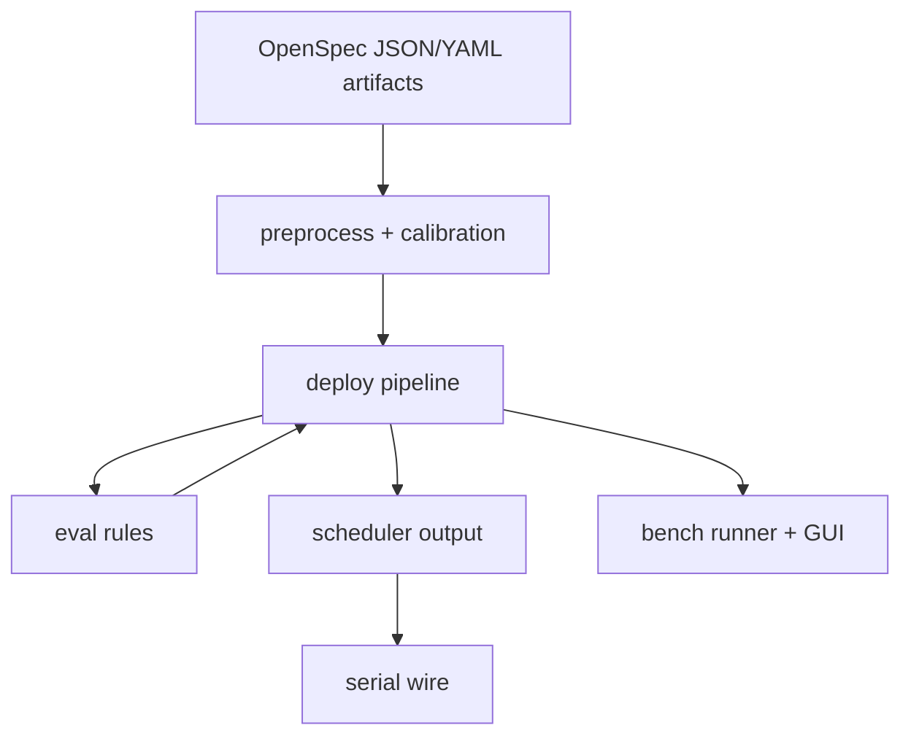

# openspec.md

## OpenSpec status snapshot
OpenSpec artifacts are versioned under `docs/openspec/v3/` and mirror implementation-facing files in:
- `contracts/`
- `protocol/`
- `data/`
- `configs/`
- `gui/`

Source index: `docs/openspec/README.md`.

## Canonical artifacts
| Domain | OpenSpec path | Runtime counterpart |
|---|---|---|
| Protocol commands | `docs/openspec/v3/protocol/commands.json` | `protocol/commands.json` |
| Frame schema | `docs/openspec/v3/contracts/frame_schema.json` | `contracts/frame_schema.json` |
| Scheduler schema | `docs/openspec/v3/contracts/sched_schema.json` | `contracts/sched_schema.json` |
| MCU response schema | `docs/openspec/v3/contracts/mcu_response_schema.json` | `contracts/mcu_response_schema.json` |
| Data manifest | `docs/openspec/v3/data/manifest.json` | `data/manifest.json` |
| Runtime default config | `docs/openspec/v3/configs/default_config.yaml` | `configs/default_config.yaml` |
| Calibration config | `docs/openspec/v3/configs/calibration.json` | `configs/calibration.json` |
| Lane geometry config | `docs/openspec/v3/configs/lane_geometry.yaml` | `configs/lane_geometry.yaml` |
| GUI layout | `docs/openspec/v3/gui/ui_main_layout.json` | `gui/ui_main_layout.json` |
| GUI runtime module dependencies | `docs/openspec/v3/gui/pyside6_runtime_modules.yaml` | `gui/bench_app/*.py` |

## Spec-to-module mapping
| Spec concern | Primary modules |
|---|---|
| Frame ingest + lane geometry | `src/coloursorter/preprocess/lane_segmentation.py` |
| Pixel-to-mm mapping | `src/coloursorter/calibration/mapping.py` |
| Decision orchestration | `src/coloursorter/deploy/pipeline.py` |
| Rule evaluation | `src/coloursorter/eval/rules.py` |
| Schedule construction | `src/coloursorter/scheduler/output.py` |
| Wire protocol serialization/parsing | `src/coloursorter/serial_interface/wire.py`, `src/coloursorter/serial_interface/serial_interface.py` |
| Bench/runtime simulation | `src/coloursorter/bench/*`, `gui/bench_app/*` |

## I/O + dependencies diagram

